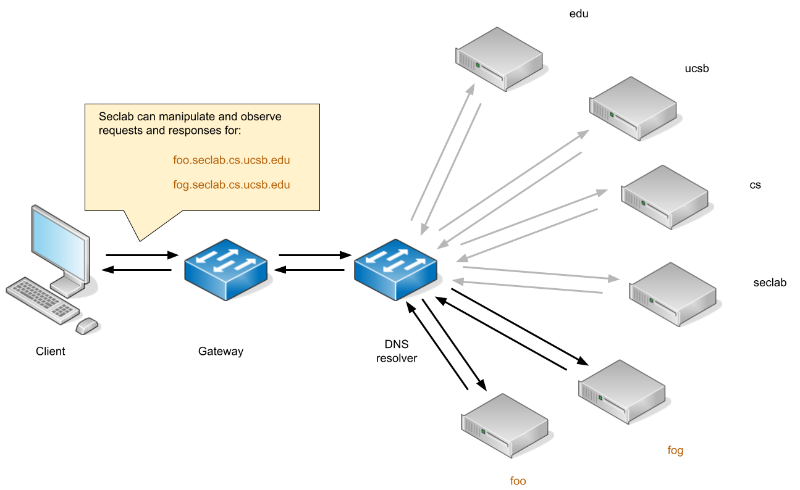

# DNS-bitflip

## Hypothesis
There is a security issue present when Bitflips happen during DNS request/resolution

## External references:
[The bitflip tools made by Luke Young](https://github.com/bored-engineer?tab=repositories&q=bf&type=&language=&sort=)
